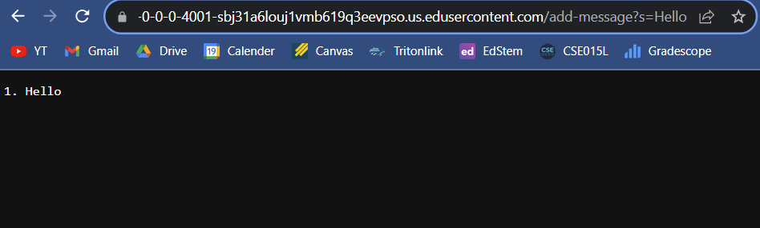
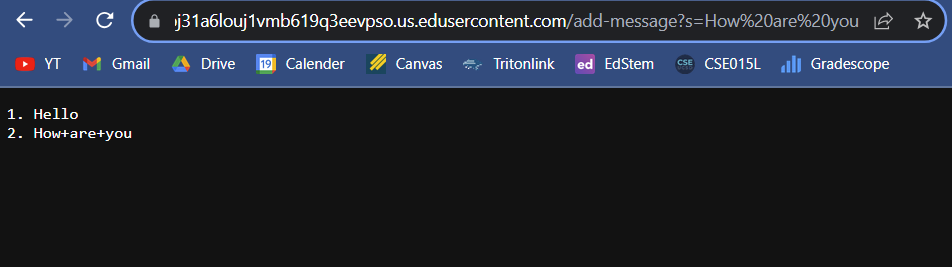

# Lab Report 2
## Part 1
**StringServer Webserver Code**

StringServer.java is below:

```
import java.io.IOException;
import java.net.URI;

interface URLHandler {
    String handleRequest(URI url);
}

class StringHandler implements URLHandler {
    private StringBuilder message = new StringBuilder();
    private int messageCounter = 0;

    public String handleRequest(URI url) {
        if (url.getPath().equals("/add-message")) {
            String query = url.getQuery();
            String[] parameters = query.split("s=");
            if (parameters.length == 2) {
                messageCounter++;
                String newMessage = parameters[1];
                message.append(messageCounter + ". " + newMessage + "\n");
                return message.toString();
            }
        }
        return "404 Not Found!";
    }
}

class StringServer {
    public static void main(String[] args) throws IOException {
        if (args.length == 0) {
            System.out.println("Missing port number! Try any number between 1024 to 49151");
            return;
        }

        int port = Integer.parseInt(args[0]);

        Server.start(port, new StringHandler());
    }
}

```



