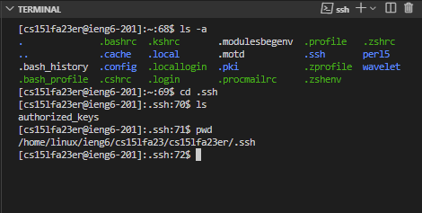

# Lab Report 2
## Part 1
**StringServer Webserver Code**

StringServer.java is below:

```
import java.io.IOException;
import java.net.URI;

interface URLHandler {
    String handleRequest(URI url);
}

class StringHandler implements URLHandler {
    private StringBuilder message = new StringBuilder();
    private int messageCounter = 0;

    public String handleRequest(URI url) {
        if (url.getPath().equals("/add-message")) {
            String query = url.getQuery();
            String[] parameters = query.split("s=");
            if (parameters.length == 2) {
                messageCounter++;
                String newMessage = parameters[1];
                message.append(messageCounter + ". " + newMessage + "\n");
                return message.toString();
            }
        }
        return "404 Not Found!";
    }
}

class StringServer {
    public static void main(String[] args) throws IOException {
        if (args.length == 0) {
            System.out.println("Missing port number! Try any number between 1024 to 49151");
            return;
        }

        int port = Integer.parseInt(args[0]);

        Server.start(port, new StringHandler());
    }
}

```
**Screenshot 1: Adding the message "Hello"**


The method 'handleRequest(URI url)' in the 'StringHandler' class. 

Relevant argurments are the URI object which will get the path '/add-message' and the query string 's=Hello'

The resulting field changes is that 'message' gets updated to "1.Hello\n". Also the messageCounter is incremented to reflect that 'Hello' is the first message. 


**Screenshot 2: Adding the message "How are you"**


The method 'handleRequest(URI url)' in the 'StringHandler' class. 

Relevant argurments are the URI object which will get the path '/add-message' and the query string 's=How%20are%20you'

Note: the %20 represents the hexadecimal value for the space character. 

The resulting field changes is that 'message' gets updated to "1. Hello\n2.How+are+you\n". Also the messageCounter is incremented to reflect that 'How are you' is the second message. 


## Part 2
**The path to the private key for your SSH key for logging into ieng6 (on your computer or on the home directory of the lab computer)**


**The path to the public key for your SSH key for logging into ieng6 (within your account on ieng6)**  


**Accesing ieng6 course specific account without being prompted for a password.**


## Part 3

Using RSA encryption to save a private key on to your public computer is something I didn't know about. I think this is a great way to not have to enter your password when accessing a remote server from a trusted personal device. It was cool to see the physical RSA key that was being used aswell, because we know that RSA encryption is used widely today but we do not actually get to see the key that is in use. 


