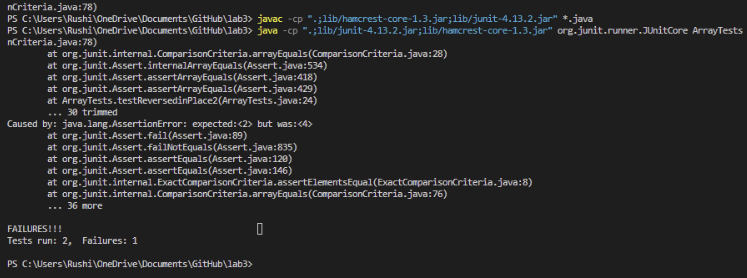
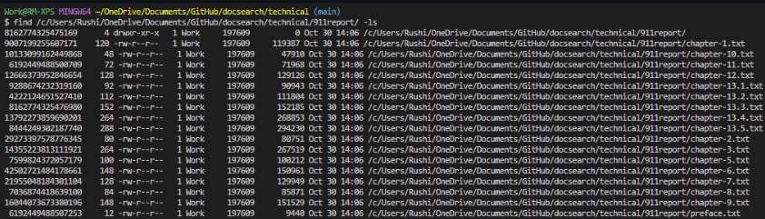
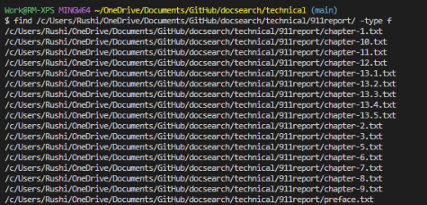
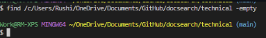

# Lab Report 3
## Part 1 - Bugs
*A failure inducing input for the buggy program*

"reverseInPlace(int[] arr)" a function within the the class ArrayExamples contains a bug and is shown below:
```
 static void reverseInPlace(int[] arr) {
    for(int i = 0; i < arr.length; i += 1) {
      arr[i] = arr[arr.length - i - 1];
    }
  }
```
*A failure-inducing input for the buggy program, as a JUnit test:*

```
  @Test
  public void testReversedinPlace2(){
    int[] input1 = {1,2,3,4,5};
    ArrayExamples.reverseInPlace(input1);
    assertArrayEquals(new int[]{5,4,3,2,1}, input1);
  }
```
*An input that doesn't induce a failure, as a JUnit test:*

```
  @Test
  public void testReversedinPlace3(){
    int[] input1 = {1};
    ArrayExamples.reverseInPlace(input1);
    assertArrayEquals(new int[]{1}, input1);
  }
```

*The symptom, as the output of running the tests*


As we can see from the console input from the tests. Lets break down the test that failed:

```
 @Test
  public void testReversedinPlace2(){
    int[] input1 = {1,2,3,4,5};
    ArrayExamples.reverseInPlace(input1);
    assertArrayEquals(new int[]{5,4,3,2,1}, input1);
  }

```


This test failed because of a Java assert error where 2 was expected in the output array but the value 4 was returned. The other test passed. 
We can tell that this failure is because of a logical error in our ```reverseInPlace(int[] arr)``` function. The function does not correctly traverse half the list and swap the variables, instead it attempts to traverse the entire list and then swap the postions. We can fix this using a temporary varaibles and changing which variables the loop traverses over. 

*The bug, as the before-and-after code change required to fix it*
Before:
```
 static void reverseInPlace(int[] arr) {
    for(int i = 0; i < arr.length; i += 1) {
      arr[i] = arr[arr.length - i - 1];
    }
  }
```
After:

```
 static void reverseInPlace(int[] arr) {
    for(int i = 0; i < arr.length/2; i += 1) {
    int temp = arr[i];
    arr[i] = arr[arr.length - i - 1];
    arr[arr.length - i - 1] = temp;
    }
  }
```

This fixes the issue because the previous solution was only switching the second half of the array. Now a temp value is added to allow for the value to be saved before it is switched. Also the loop only traveses the first half of the array and swaps with the corresponding position in the second half of the array.

## Part 2 - Researching Commands

I choose the command "find". 

The 4 interesting command-line options are: -ls, -type f, -type d, -mepty. 2 examples of each are shown below. 

**-ls**
The -ls option lists the contents fo a directory recursively, this means it lists all the subdirectories within the target. This is very similar to the -ls R command. The output is shown below, the input was:  *find /c/Users/Rushi/OneDrive/Documents/GitHub/docsearch/technical -ls*


Here is another example of -ls in find. This time it is recursively finding everything in ~/technical/911reports



**-type f**

The -type f option lists only the files within the given file path. Below are all the files in ~/technical/911reports.



Below are all the files in ~/technical/biomed

The input was *find /c/Users/Rushi/OneDrive/Documents/GitHub/docsearch/technical/biomed/ -type f*
The output is in the screenshot below:


**-type d**

The -type d options lists only the directories within the given file path. Below are all the directories within ~/technical


Below are all the directories within ~/technical/911Report/ (There are no directories within ~/technical/911Report/)


**-empty**

The -empty option lists the empty files within the given directory. Below is an example showing all the empty files within  ~/technical/911Reports/. (It shows that there are no empty files within ~/technical/911Reports/)


The example below seaches the entire ~/technical directory for empty files. The output shows that there are no empty files within the whole ~/technical directory (Interesting, the ANC data set has not empty files!)



**Sources Cited**

All commands were sourced from RedHat's official website from the following article "10 ways to use the Linux find command" (https://www.redhat.com/sysadmin/linux-find-command)


