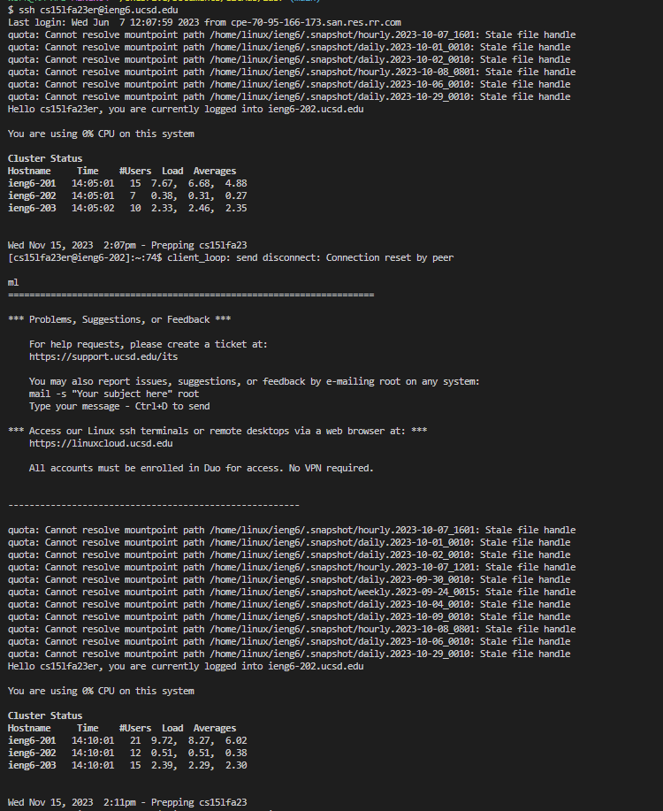
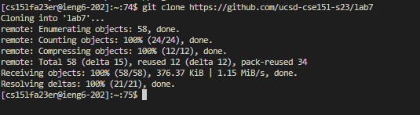

# Lab Report 4

## Step 4

Step 4 is logging in ieng6. In order to do this we must use the ssh command. I have the ssh command copied in notes so I know that it is ```ssh cs15lfa23er@ieng6.ucsd.edu``` because we the password has been set up previously we will not be prompted for a password. 
Keys Pressed: ```<CTRL-C><CTRL-V><ENTER>```
As we can see below simply entering this command will log us into the SSH server, I will not be prompted for a password 



## Step 5
Cloning the fork of the repository using the SSH URL. It is very important for this step we use the SSH URL not the HTTPS URL. The SSH URL for this repository is ```git@github.com:ucsd-cse15l-s23/lab7.git```
We know that this is a SSH URL because of the ```git@github.com:``` Since we know that we have the correct URL we can proceed with cloning using the ```git clone``` command as shown below.

Keys Pressed: ```"git clone"<CTRL-C><CTRL-V><ENTER>```

Once this command is executed we are shown that the repository is successfully cloned. 


## Step 6
This step invloved using the javac command for running our tests. This was first introduced in Lab 4 and the command changes depending on operating system. I went to Lab 4 to find the appropriate command for windows which are the following ```local $ javac -cp ".;lib/hamcrest-core-1.3.jar;lib/junit-4.13.2.jar" *.java``` & ```local $ java -cp ".;lib/junit-4.13.2.jar;lib/hamcrest-core-1.3.jar" org.junit.runner.JUnitCore ArrayTests``` ArrayTests must be replaced with ```ListExamplesTests```

Keys Pressed: ```<CTRL-C><CTRL-V> <DEL X10> "ListExamplesTests <ENTER><CTRL-C><CTRL-V>"```

## Step 7
This step involves changing index1 to index2 in order to fix the bug in the code. We are able to do this efficiently using VIM and some of the commands in normal mode before entering insert mode to make the wanted changes. The steps including opening the ```ListExamples.java``` file in VIM, using the arrow keys in normal mode to move the cursor, utilizing ```x``` in normal mode to delete a character, entering insert mode, adding the number "2", saving and closing. 

Keys Pressed: ```<UP>UP>UP>UP>UP><RIGHT><RIGHT><RIGHT><RIGHT><RIGHT><RIGHT> X I 2 <ESC> :wq```
