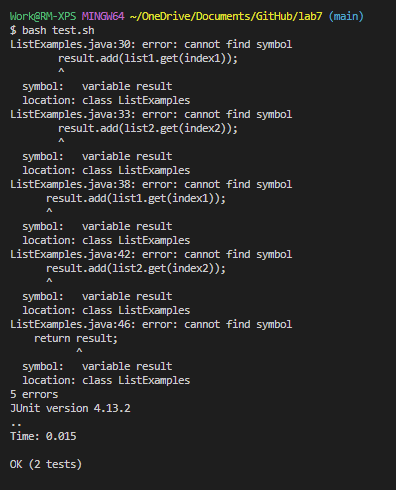
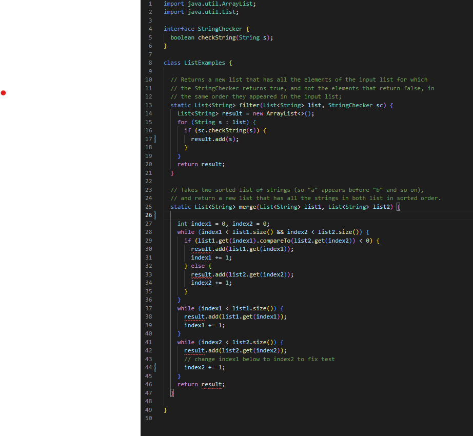
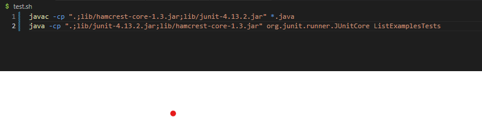
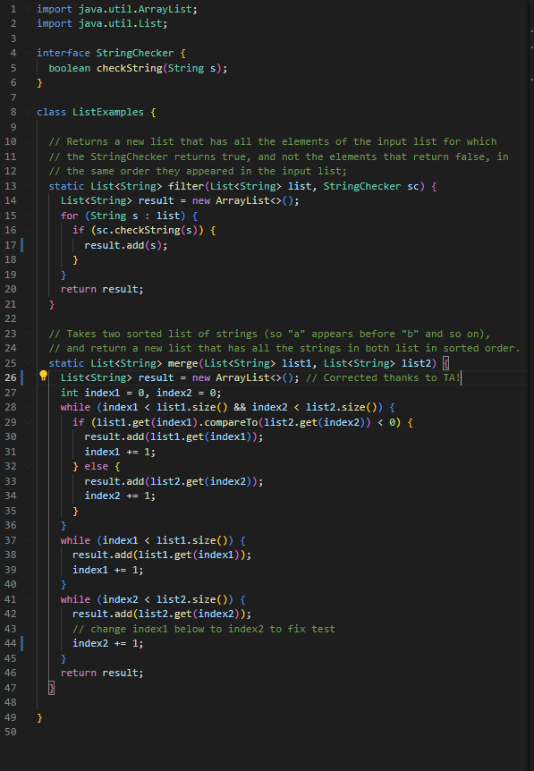

# Lab Report 5

## Part 1

## Multiple Errors when running ListExamples.java!

Student: Both tests seem to pass but I am getting 5 errors when run the bash script. Can someone please help? I have provided a screenshot of the output and my code. 

I simply ran the code using test.sh: ```bash test.sh```





TA: Take a look at your code carefully, you have intilaized "result", a new ArrayList on line 14, but keep in mind how scopes work in Java. Ensure that result is initalized within the merge function.

Student: I see what I did wrong, thanks! The tests work now! Here are my changes:


